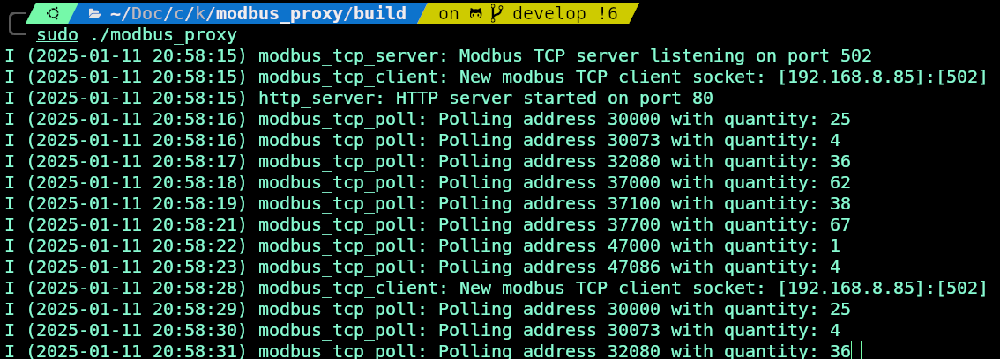

# Modbus Proxy

The **Modbus Proxy** is a lightweight tool designed to manage and facilitate communication with devices that only allow one open connection at a time. It acts as a mediator between multiple clients and the Modbus TCP server, ensuring smooth and efficient communication.

This proxy was specifically designed for **Huawei Inverters**, where the dongle only permits one active connection at any given time. With Modbus Proxy, you can overcome this limitation and enable multiple clients to access the inverter seamlessly.

---

## Features

- **Connection Management**: Handles communication for devices that only allow one active connection.
- **Data Caching**: Reduces the load on the Modbus server by caching data for repeated client requests.
- **Reliable Communication**: Manages retries for failed requests to maintain consistent communication.
- **Configurable Polling**: Allows you to set polling intervals and retry limits.

---

## How It Works

1. The Modbus Proxy connects f.e. to the Huawei inverter via its dongle.
2. It polls data from the inverter at configurable intervals.
3. The data is cached and provided to clients that connect to the proxy, avoiding multiple connections to the inverter dongle.

---

## Installation

1. Clone the repository:

   ```bash
   git clone <repository_url>
   cd modbus_proxy

2. Build:

   ```bash
   mkdir build
   cd build
   cmake ..
   camke --build .

3. Start the proxy::

   ```bash
   ./modbus_proxy





